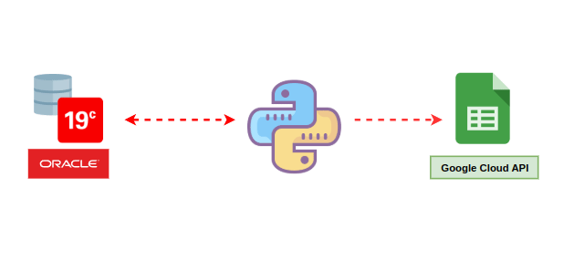
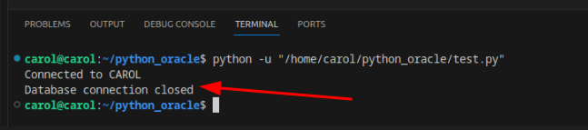
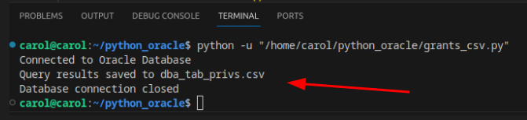
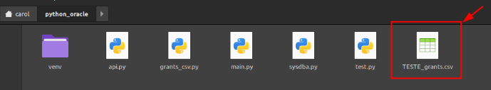
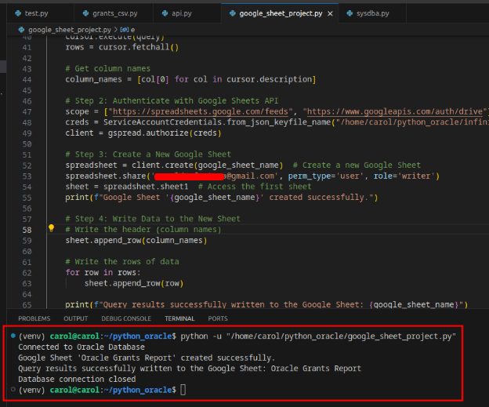

<div style="text-align: center;">
  
</div>

---

**Requirements:**
- An Oracle 19c database installed in a VM 
- Install venv on your local machine
- Install Python 
- Install Oracle Instant Client 
- To have an account at google GCP (NO PAYMENTS REQUIRED!!)
- Use CHAT GPT help (lots of it)

---

***On this small project, we will be able to access an Oracle database using Python, and retrieve some grants from a user, writing them in a csv file in our pesonal Google Drive (using Google's API through gspread lib)***

#### PS: I use Linux Mint on my personal computer, so this is a Linux tutorial.

---

**1. Check listener.ora in your Oracle database that's installed in your VM. Make sure the listener is active and configured to accept remote connections.**

**2. Check your tnsnames.ora and make sure it is also configured correctly. Make sure Oracle's SID and service name are correct.Also, make sure to disable your VM's firewall and SELINUX so you can access the database externally. That shouldn't be a problem hence the fact that this is a home lab.**

disable SELINUX
~~~bash
vi /etc/selinux/config
~~~

disable your VM's firewall
```bash
systemctl stop firewalld
systemctl disable firewalld
```

**3. Let's now install venv in order to create an isolated environment for this activity. (PS: You can also use docker if you prefer!)Make sure you choose a specific directory for your project before installing venv, since it will have to be installed on that directory!**

ex: 
/home/carol/python_oracle
```bash
sudo apt install python3.11-venv
```

Remember to active venv before moving on to the next step!!
```bash
. venv/bin/activate
```

**4. Install the libs you'll need for this activity**

python libs
```bash
pip install cx_Oracle csv gspread oauth2client
```

**5. Install Oracle Instant Client. You can download it directly from Oracle's database here**
[CLICK HERE to download Oracle Instand Client](https://www.oracle.com/database/technologies/instant-client.html)

**PS: I extracted it at /opt/oracle and renamed it to "instantclient"**

**6. Add that directory to linux LD_LIBRARY_PATH**

```bash
export LD_LIBRARY_PATH=/opt/oracle/instantclient:$LD_LIBRARY_PATH
```

**7.Now, on your chosen project's directory, try seeing if Oracle Client is working with cx_Oracle lib.**

#### BIG PS: DON'T FORGET TO RUN VENV LOCALLY, OTHERWISE, NONE OF THE LIBS YOU'VE INSTALLED WILL WORK!!!

```bash
. venv/bin/activate
```

(It should return the version of the client installed)
```python
import cx_Oracle
print(cx_Oracle.clientversion())
```

**8. Before trying to connect to the database, make sure to go to /etc/hosts in your machine, and point out the dns for your VM's ip, so it matches the information on both Oracle listener and tnsnames.**

**9. Now we are all set to try to connect to our database using Python. Make sure to use the correct info using the command below**

from your machine, run python, and then this command
```python
import cx_Oracle
connection = cx_Oracle.connect("CAROL/CAROL@ol7-dba.localdomain:1521/orclpdb.localdomain")
```
Notice that:
-my user in the PDB is CAROL and password is also CAROL
-my VM's dns is ol7-dba.localdomain
-my pdb is listening on 1521 port
-orclpdb.localdomain is my PDBS service name

**10. Now, with the help of chat gpt, let's try to connect to our Oracle database.**

```python
import cx_Oracle

# Connection details
username = "CAROL"
password = "CAROL"
dsn = "ol7-dba.localdomain:1521/orclpdb.localdomain"

try:
    # Connect to the Oracle database
    connection = cx_Oracle.connect(f"{username}/{password}@{dsn}")
    print(f"Connected to {username}")

    # Perform database operations here if needed

except cx_Oracle.DatabaseError as e:
    # Handle database connection errors
    print(f"Database connection error: {e}")

finally:
    # Ensure the connection is closed
    if 'connection' in locals() and connection:
        connection.close()
        print("Database connection closed")
```

Output:



**11. Now let's try writing querying the database for some grants regarding a specific user, and see if python will write it down on a csv file in our project directory.**

```python
import cx_Oracle
import csv

# Oracle Database Connection Details
host = "ol7-dba.localdomain"  # e.g., "localhost" or "192.168.1.100"
port = "1521"             # Default Oracle port
service_name = "orclpdb.localdomain"  # e.g., "orclpdb.localdomain"
username = "CAROL"  # e.g., "SYS"
password = "CAROL"  # e.g., "your_password"

# SQL Query
query = """
SELECT 
    a.GRANTEE,
    a.OWNER,
    a.TABLE_NAME,
    a.PRIVILEGE,
    a.TYPE,
    b.INSTANCE_NAME
FROM 
    DBA_TAB_PRIVS a
CROSS JOIN 
    V$INSTANCE b
WHERE 
    a.GRANTEE = 'TESTE'
"""

# Output CSV file
output_file = "TESTE_grants.csv"

try:
    # Create a Data Source Name (DSN)
    dsn = cx_Oracle.makedsn(host, port, service_name=service_name)
    
    # Connect to the Oracle database
    connection = cx_Oracle.connect(user=username, password=password, dsn=dsn)
    print("Connected to Oracle Database")

    # Create a cursor to execute the query
    cursor = connection.cursor()
    cursor.execute(query)

    # Fetch all rows from the query result
    rows = cursor.fetchall()

    # Get column names from the cursor description
    column_names = [col[0] for col in cursor.description]

    # Write the results to a CSV file using csv.writer
    with open(output_file, mode="w", newline="") as file:
        csv_writer = csv.writer(file)
        
        # Write the header (column names)
        csv_writer.writerow(column_names)
        
        # Write the data rows
        csv_writer.writerows(rows)
    
    print(f"Query results saved to {output_file}")

except cx_Oracle.DatabaseError as e:
    # Handle database connection errors
    print(f"Database connection error: {e}")

finally:
    # Ensure the database connection is closed
    if 'connection' in locals() and connection:
        connection.close()
        print("Database connection closed")
```

output:


CSV file written locally:


**12. Now let's write this csv in our Google Drive account. I didn't want to mess with Google's API on this case, and instead, to make it easier, I'm just using a lib called gspread that facilitates me to use Google Sheets specifically.** 

So first, you're gonna need to log on to Google Cloud Console. 

Now, create a new project at GCP and enable these API's:

- Google Sheets API
- Google Drive API

Now let's create a Service Account to use these API's.

- go to API'S & Services
- go to Credentials
- hit "Create credentials" and select "Service Account" and create one

Now that you have your Service Account, let's create a key

- go to your Service Account that you've just created
- go to "KEYS" > "ADD KEY" > "Create New Key" > select "JSON" and hit create
- this key will be downloaded to your pc

Now you can use the chat gpt generated code below, and just change these important information:

- the python variables to connect to your database
- the user in your SQL query
- point the directory where the JSON key from GCP is:
  ServiceAccountCredentials.from_json_keyfile_name("/your_path_here/example.json", scope)
- your google e-mail under: "spreadsheet.share"

Ok. Now that you've fixed your code, just go ahead and run it.

```python
import cx_Oracle
import gspread
from oauth2client.service_account import ServiceAccountCredentials

# Oracle Database Connection Details
host = "ol7-dba.localdomain"
port = "1521"
service_name = "orclpdb.localdomain"
username = "CAROL"
password = "CAROL"

# SQL Query
query = """
SELECT 
    a.GRANTEE,
    a.OWNER,
    a.TABLE_NAME,
    a.PRIVILEGE,
    a.TYPE,
    b.INSTANCE_NAME
FROM 
    DBA_TAB_PRIVS a
CROSS JOIN 
    V$INSTANCE b
WHERE 
    a.GRANTEE = 'TESTE'
"""

# Google Sheets details
google_sheet_name = "Oracle Grants Report"  # Name of the new Google Sheet

try:
    # Step 1: Connect to Oracle Database
    dsn = cx_Oracle.makedsn(host, port, service_name=service_name)
    connection = cx_Oracle.connect(user=username, password=password, dsn=dsn)
    print("Connected to Oracle Database")

    # Execute the query
    cursor = connection.cursor()
    cursor.execute(query)
    rows = cursor.fetchall()

    # Get column names
    column_names = [col[0] for col in cursor.description]

    # Step 2: Authenticate with Google Sheets API
    scope = ["https://spreadsheets.google.com/feeds", "https://www.googleapis.com/auth/drive"]
    creds = ServiceAccountCredentials.from_json_keyfile_name("/home/carol/python_oracle/XXXXX.json", scope)
    client = gspread.authorize(creds)

    # Step 3: Create a New Google Sheet
    spreadsheet = client.create(google_sheet_name)  # Create a new Google Sheet
    spreadsheet.share('carolXXXX@gmail.com', perm_type='user', role='writer') 
    sheet = spreadsheet.sheet1  # Access the first sheet
    print(f"Google Sheet '{google_sheet_name}' created successfully.")

    # Step 4: Write Data to the New Sheet
    # Write the header (column names)
    sheet.append_row(column_names)

    # Write the rows of data
    for row in rows:
        sheet.append_row(row)

    print(f"Query results successfully written to the Google Sheet: {google_sheet_name}")

except cx_Oracle.DatabaseError as e:
    print(f"Database connection error: {e}")

except Exception as e:
    print(f"An error occurred: {e}")

finally:
    if 'connection' in locals() and connection:
        connection.close()
        print("Database connection closed")
```

output:


Now let's check our google drive under "Shared with me" and check to see if our Google Sheet file is there


tadaaaa  it worked :)

### I hope you find this tutorial helpful, and that it encourages you to automate as many tasks as you can!!
---
