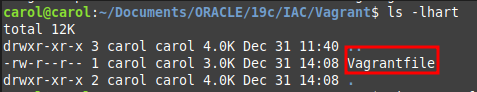
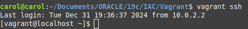

---

**Requirements:**
- **Oracle VM VirtualBox**
- **Vagrant** 

---

### Note: In terms of network interface, I did not use NAT in this tutorial. I used BRIDGE instead.


---

***What is Vagrant?***

*Vagrant is an open-source tool for building and managing virtualized development environments. It simplifies the setup of consistent and reproducible environments for developers by using lightweight, portable, and customizable configurations. With Vagrant, you can define the entire environment (e.g., operating system, software, network) in a single file called a "Vagrantfile".*

***Why use Vagrant?***

- *Consistency*: *Avoid "it works on my machine" issues by sharing the same environment across all team members.*
- *Simplicity: Quickly spin up virtual machines with a single command.*
- *Portability: Easily share configurations for development environments.*
- *Flexibility: Supports multiple providers like VirtualBox, Docker, and AWS.*

***What is a Vagrant Box?***

*A Vagrant box is a prepackaged environment that contains a complete operating system image and necessary configuration for Vagrant. It's like a template that Vagrant uses to create and provision virtual machines quickly.*

***What is a Vagrantfile?***

*A Vagrantfile is a configuration file used by Vagrant to define the settings and behavior of a virtual machine (VM). It is written in Ruby, but you don't need to know Ruby to use it (Vagrantfiles are designed to be simple and human-readable).
It's used to specify the operating system, resources (CPU, RAM), and the base box (template VM) to use. Also to automate software installation, configure network, etc.*

---

**1. Download Oracle VM VirtualBox and install it on your local machine. You can choose from various types of OS.**

[CLICK HERE to download Oracle VM](https://www.virtualbox.org/wiki/Downloads)

**2. Download and install Vagrant on your machine.**

[CLICK HERE to download Vagrant](https://developer.hashicorp.com/vagrant/install#linux)


I use Linux Mint on my personal machine, and since its an Ubuntu distro, I used this command to download/install it.

```sh
wget -O - https://apt.releases.hashicorp.com/gpg | sudo gpg --dearmor -o /usr/share/keyrings/hashicorp-archive-keyring.gpg
echo "deb [arch=$(dpkg --print-architecture) signed-by=/usr/share/keyrings/hashicorp-archive-keyring.gpg] https://apt.releases.hashicorp.com $(lsb_release -cs) main"
| sudo tee /etc/apt/sources.list.d/hashicorp.list
sudo apt update && sudo apt install vagrant
```

Double check if Vagrant is installed. 

```sh
vagrant --version
```
or

```sh
dpkg -l | grep vagrant
```

**3. Download a Vagrant Box. Instead of building my own Vagrant Box, in this case I just pulled a box from [title](https://portal.cloud.hashicorp.com/vagrant/discover) 
   I chose Oracle Linux 8 from developer Tim Hall**
   
```sh
vagrant box add oraclebase/oracle-8 --provider virtualbox
```

To check all Vagrant boxes in your machine, try:

```
vagrant box list
```

If you want to remove your Vagrant box, use this command:

```
vagrant box remove oraclebase/oracle-8
```

You can also download it directly from Oracle's official repository

```
vagrant box add --name ol8 https://yum.oracle.com/boxes/oraclelinux/ol8/ol8.box
```

**4. Let's work on our Vagrantfile now. Choose a directory for your Vagrantfile in your local machine. Navegate to the directory chosen by you through command line. 
Example: I chose path /home/carol/Documents/ORACLE/19c/IAC/Vagrant**

Once you're in the right directory, start your Vagrantfile.

```
vagrant init
```

If you list it, you can see that a Vagrantfile was created. *Do not rename it.*


Open the file. You will notice that it comes with a bunch of instructions for a "recipe" by default. 

In my case,  to make it simple, I just asked chat gpt to help me with a recipe for my Vagrantfile, and I prompted my expectations in terms of configuration, such as RAM, storage size, CPU, and network interface. 

It wasn't working well, because it gave me a wrong line of code regarding storage destination. 

I had to look up Vagrant documentation to work around that issue:

[CLICK HERE to see Vagrant's Documentation](https://developer.hashicorp.com/vagrant/docs/disks/usage)

Also, this code includes making the VM's IP static, so it doesn't change when rebooted.

The result is this:
```
Vagrant.configure("2") do |config|
  # Define the base box
  config.vm.box = "oraclebase/oracle-8"
  # Set the VM storage config
  config.vm.disk :disk, size: "60GB
  # Configure the VM settings
  config.vm.provider "virtualbox" do |vb|
    vb.name = "OracleLinux8_VM"
    vb.cpus = 2
    vb.memory = 4096
  end
  # Configure the network to use a bridged adapter
  config.vm.network "public_network", bridge: "wlp1s0" 
  # Provisioning can be added here if needed
  config.vm.provision "shell", inline: <<-SHELL
    sed -i 's/dhcp/static/' /etc/sysconfig/network-scripts/ifcfg-eth1
    echo IPADDR=$(ifconfig eth1 | awk '/inet / {print $2}') >>  /etc/sysconfig/network-scripts/ifcfg-eth1
    systemctl reload network
    echo "Oracle Linux 8 VM setup complete."
  SHELL
end
```

Now save that recipe into your Vagrantfile and exit. 

**5. Now that we've got the recipe going, let's bring that VM up.**

```
vagrant up
```

You will notice that just with that command alone, the VM will spin up.


**6. Access your VM through command line**

```
vagrant ssh
```


### Note: by default, user vagrant's password is vagrant. 

Now once connected to the VM you can change the password for your users, including root.

**7. If you want to destroy your VM, just use the "destroy" command. Make sure**

```
vagrant destroy -f
```

### Hope you find this tutorial helpful! See ya.

---
